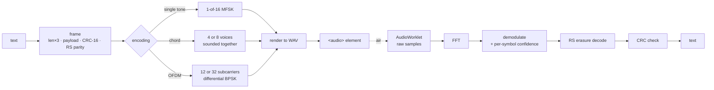

# Ultradata

Peer-to-peer text between two devices over **sound** — no Bluetooth, no Wi-Fi, no
network, no server. Data rides a near-ultrasonic acoustic carrier at 17.6–19.8 kHz,
above most adult hearing.

One HTML file. No dependencies, no build step, nothing fetched at runtime. Open it and
it works, offline.

**[▶ Live demo](https://jbachand.github.io/ultradata/)** — open it on two devices in the
same room, start listening on one, and send from the other.

> [!IMPORTANT]
> **You probably can't hear this. Other people and animals can.**
>
> The 17.6–19.8 kHz carrier is inaudible to *most adults* only because high-frequency
> hearing declines with age — by ~25 many people have lost the top of the range, and by
> ~40 most have. That is the entire premise, and it is a statement about the listener,
> not about the sound.
>
> **Children and teenagers routinely hear the whole band**, often clearly and often as
> unpleasant. **Dogs hear to roughly 45 kHz and cats to roughly 64 kHz**, so 18–19 kHz
> is not a faint edge tone to them — it sits comfortably mid-range, and a transmission
> is simply a loud, obvious noise in the room.
>
> So: keep the drive level down, don't leave it transmitting on a loop around kids or
> pets, and don't treat it as a covert channel. It isn't one — it's a channel that
> happens to be quiet to the particular ears of an adult human.

```
┌──────────────┐                                   ┌──────────────┐
│   sender     │   ((( ~18–19.8 kHz air )))        │  receiver    │
│              │ ─────────────────────────────────▶│              │
│ text → bytes │                                   │ FFT → bytes  │
│ → FEC → tones│                                   │ → FEC → text │
└──────────────┘                                   └──────────────┘
```

---

## Why this is harder than it sounds

A phone speaker and a phone microphone make a *terrible* radio. The constraints that
shaped every decision here:

| Constraint | Consequence |
|---|---|
| Adults hear below ~17.6 kHz | the carrier can't go lower |
| Speakers roll off above ~19.8 kHz | the carrier can't go higher |
| → **~2.2 kHz of usable spectrum** | tens of bytes per second, not kilobytes |
| Rooms are reverberant | echoes smear symbols and null out carriers |
| Speakers are nonlinear | ultrasonic pairs mix down into *audible* buzz |
| Phones resample, drift, and drop blocks | timing can never be assumed |

Everything below is a response to one of those.

---

## Signal chain



**Transmit** renders the entire transmission to a WAV in memory and plays it through an
`<audio>` element. **Receive** captures raw samples into an AudioWorklet ring buffer and
runs its own FFT. Both of those are platform-driven choices, explained in
[Platform reality](#platform-reality).

---

## Three encodings

All three share one frame format. The receiver picks its demodulator from a tone in the
start marker rather than from its own UI, so two devices set differently still talk.

### Single tone — 1-of-16 MFSK

Sixteen tones spaced 100 Hz apart. One sounds per 60 ms symbol; whichever is loudest
*is* the symbol. 4 bits each.

Non-coherent and very hard to corrupt — it ignores amplitude, phase, and channel shape
entirely. This is the mode that still works when nothing else does.

### Chord — parallel voices

The band is split into independent **voices**, each owning 4 tones. Every voice sounds
one of its tones *simultaneously*, and the receiver's FFT reads each voice's sub-band
separately.

| Band | Voices | Per symbol |
|---|---|---|
| Ultrasonic | 4 | 1 byte |
| Audible | 8 | 2 bytes |

Summed tones get **Newman phases** (φₖ = πk²/K) to hold the crest factor down, then each
symbol is normalised to its own peak — so a chord leaves the speaker as loud as a single
tone would, instead of 1/K as loud.

### OFDM — sending a spectrum

Every subcarrier carries payload, and the data lives in **phase** rather than level.

| Band | Subcarriers | Span | Bits/symbol |
|---|---|---|---|
| Ultrasonic | 12 | 18.0–19.0 kHz | 12 |
| Audible | 32 | 1.6–4.5 kHz | 32 |

Three properties make it survive a room:

**Differential BPSK across time.** Each subcarrier is compared with *itself* one symbol
earlier, so the channel cancels exactly. Amplitude never enters the decision, and neither
does absolute phase, however jagged the room makes it.

> This started as differential across *adjacent subcarriers*, which quietly assumes the
> channel's phase varies smoothly with frequency. Reflections break that assumption.
> Measured against a single echo from 34 cm — a desk surface — frequency-differential
> went from 80/80 symbols to **0/80**. Time-differential: 40/40.

**One bit per carrier, not two.** BPSK puts one bit in a 180° decision region where QPSK
puts two in 90°, and halving the rate doubles energy per bit. Measured with the same
modulator, changing only the constellation:

| Noise | DQPSK errors | DBPSK errors |
|---|---|---|
| 0.7 | 0.81% | **0.00%** |
| 0.9 | 2.58% | **0.10%** |
| 1.3 | 9.14% | **1.61%** |

About **4 dB** of extra margin — worth far more than the throughput on a link that is
error-limited rather than bandwidth-limited.

**A cyclic prefix.** The symbol's own tail is pasted in front of it, so reverb lands in
the guard instead of the data. Symbols are 18.7 ms (10.67 ms useful + 8 ms guard, about
2.7 m of path difference) against MFSK's 60 ms. Subcarriers sit on exact multiples of
`sampleRate/512`, which is what makes them mutually orthogonal — so the AudioContext is
opened at 48 kHz explicitly, and OFDM *receive* is refused outright on a device that
captures at some other rate.

Symbol edges get a 32-sample raised-cosine taper. Butting raw symbols together leaves a
discontinuity at every boundary, and at one boundary per 18.7 ms that is a ~54 Hz click
train — broadband and plainly audible even though every subcarrier is ultrasonic.

---

## Frame format

```
preamble → start marker → [training ×4] → len ×3 → payload → CRC-16 → RS parity
```

**The length byte is sent three times** and bit-wise majority-voted, because the receiver
has to know the frame size *before* error correction can run. A corrupted length would
desynchronise everything after it.

**Reed–Solomon over GF(256)**, 8 parity bytes for MFSK and 16 for OFDM. MFSK decides by
argmax and is hard to corrupt; OFDM decides by phase and runs much closer to the noise
floor, where a 3–5% bit error rate damages 8–12 bytes of a 37-byte frame.

### Erasure decoding

RS corrects `nsym/2` errors when it has to *find* them, but `nsym` erasures when it is
*told where they are*. The demodulator already knows which symbols it nearly guessed on —
the dB margin between the winning tone and the runner-up is 50–70 dB on a clean symbol
and a couple of dB on a marginal one. Handing those positions over **doubles correction
capacity for free**:

| Damaged bytes | With erasures | Plain RS |
|---|---|---|
| 1–4 | 200/200 | 200/200 |
| 5–8 | **200/200** | 0/200 |

Two safety properties matter as much as the capacity:

- The erasure set **grows from the smallest**, and never shrinks. With *k* unknowns
  against `nsym` syndromes the check is only meaningful while `k < nsym`; at `k == nsym`
  the system is exactly determined, so *some* magnitude assignment always satisfies it
  and the syndromes stop being evidence at all.
- At exactly `nsym` erasures the CRC is the arbiter, and it holds. With 9 damaged bytes —
  past any correction — the codec returns confident nonsense, and the CRC rejected it
  **200/200 times**. No wrong text ever reaches the reader.

---

## Synchronisation

The hardest part, and almost all of it is fighting timing uncertainty.

**Sync on the marker's rising edge, not its falling edge.** The analyser reports the last
42.7 ms, so a tone's *disappearance* is smeared across a whole window while its arrival
is sharp.

**Subtract the analyser's own lag.** Its Blackman window puts new samples where the
weight is ≈0, so an observed rise trails the real one by a fixed fraction of the window.

**Search wide and asymmetrically for the OFDM boundary.** Capture latency is unknown and
device-dependent — roughly 25 ms on a desktop, 60–100 ms on a phone, far more over
Bluetooth — and it always *delays* samples rather than advancing them. A symmetric ±33 ms
search could not reach a phone's boundary at all.

| Estimate off by | Old ±33 ms search | Wide folded search |
|---|---|---|
| 100 ms | ✗ | ✓ |
| 400 ms | ✗ | ✓ |

Rather than hunt for one correlation peak, the prefix correlation is folded **modulo the
symbol period**, summing every symbol in the window onto a single phase estimate. That
phase repeats every symbol, so it still cannot say *which* symbol begins the frame — the
tripled length byte settles that, with one trial decode per candidate boundary.

**Accept a tolerant match, then take the best candidate.** Demanding all 24 bits of the
length field be perfect throws away the redundancy it was tripled for: at a 5% bit error
rate an exact match locks 29% of the time and a ≤6-bit match 97%. And every candidate is
scored with the **global minimum** taken — never the first one under a threshold, because
with ~27 boundaries to test, first-match-wins lets a false positive be accepted before
the true alignment is even reached.

**Integrate every FFT frame that falls inside a symbol** (~4 readings averaged) instead
of taking one well-timed snapshot. At 60 ms symbols a snapshot leaves a few ms of slack;
integrating widens the tolerance to roughly ±20 ms.

**Never skip a symbol.** If a poll arrives late, the skipped symbols still emit a
placeholder — dropping one would shift every following byte and destroy the frame, while
a blank costs a single byte that RS repairs.

---

## Platform reality

Most of the hard-won engineering here is not DSP. It is iOS.

**Transmit through a media element, not Web Audio.** iOS plays Web Audio in the *ambient*
audio category, which the ringer switch silences and which never registers a Now Playing
session — so the symptom is "no sound, and nothing in Control Centre". `<audio>` elements
use *playback* instead: they ignore the mute switch and satisfy mobile autoplay policy.
So the whole transmission is rendered to a WAV and played as media.

**Capture in an AudioWorklet, indexed by absolute frame.** OFDM needs complex FFTs of
exact sample windows, which the magnitude-only `AnalyserNode` cannot provide. This began
as a `ScriptProcessorNode`, which was a mistake twice over: it runs on the **main
thread**, so on a phone it drops blocks *and* starves the analyser that the MFSK modes
depend on. Blocks are written at their absolute frame index rather than appended, so a
dropped block leaves a hole instead of sliding the whole ring and destroying symbol
alignment.

**An open microphone routes output to the earpiece.** iOS switches to `playAndRecord`
whenever input is live, and that category's default route is the *receiver* — so a
carrier sent while listening leaves the phone far too quietly to cross a room, with the
in-call indicator showing.

The resolution is that loudness and self-confirmation are **not** actually exclusive: the
microphone is released so the early copies leave the loud speaker, then reacquired just
before the **last** copy, which the microphone hears in full and decodes into the delivery
tick. Only that final copy is earpiece-quiet, and it only has to travel a few centimetres.

**Recovery is not optional.** Anything can suspend the audio session — a call, another
app, speech synthesis — and a suspended context leaves the spectrum frozen while the page
still looks alive. The watchdog tracks *sample flow* rather than trusting `ctx.state`,
because an audio-session change can tear down the input stream while the context still
reports `running`. Resuming cannot revive that, so the stream is rebuilt instead, bounded
to 3 attempts.

**Speech obeys the silent switch and nothing can change that.** `speechSynthesis` uses a
category the switch mutes, with no web API to override it. Holding the session open with
a looping media element — the usual trick — does not make speech inherit it. So the
chat's own cues ride the media element instead: a rising chime on arrival, a shorter
higher one when your own broadcast is heard back. Both are audible on silent, and both
sit between 392 Hz and 1.2 kHz — below the audible carrier's 1.6 kHz floor, so they can
never be mistaken for data.

**Speaker nonlinearity demodulates ultrasound into audible sound.** Every pair of
carriers mixes down to its difference frequency; 12 subcarriers make 66 pairs landing
across the audible band. This is exactly how parametric "audio spotlight" speakers work,
deliberately. No digital measurement can see it — the rendered waveform is perfectly
linear, and the distortion is produced by the transducer. The only lever is drive level,
since intermodulation grows with the square or cube of amplitude while the carrier grows
linearly.

---

## Throughput

Measured for a 120-byte message, handshake and FEC included:

| Encoding | Ultrasonic | Audible |
|---|---|---|
| Single tone | 16.6 s (7 B/s) | 16.6 s (7 B/s) |
| Chord | 8.6 s (14 B/s) | 4.6 s (26 B/s) |
| OFDM | 2.1 s (57 B/s) | 1.0 s (116 B/s) |

Ultrasonic OFDM occupies about 1.1 kHz to deliver 57 payload bytes/s, so roughly
0.4 bit/s/Hz after the cyclic prefix and parity are paid for. A wired modem in the same
bandwidth would carry many times that with QAM and adaptive equalisation. Throwing away
amplitude and absolute phase is what buys the robustness, and on this channel that trade
is worth making.

---

## Honest limits

- **Range**: a few metres in a quiet room. OFDM needs roughly 8–10 dB SNR where MFSK
  decodes below the noise floor, so it trades range for speed.
- **"Inaudible" is approximate**, and only for adults — see the note at the top. Kids,
  teenagers and animals hear it plainly. This is not a covert channel.
- **Hardware varies.** Many laptop speakers roll off above ~16 kHz. Bluetooth speakers
  almost always cut off below 17 kHz and cannot carry this at all.
- **120-byte cap.** This is a channel for text, links, codes and contact cards — not
  files. A 10 KB image would take minutes at best.
- **OFDM receive needs 48 kHz** capture. The app detects a mismatch and says so.

---

## Running it

Playing sound needs no permission; capturing it does. The microphone requires a **secure
context**, so serve over `localhost` or HTTPS:

```bash
python3 -m http.server 8000     # then open http://localhost:8000
```

Two devices on a LAN need HTTPS, since a plain-HTTP origin blocks the microphone. Any
local TLS front-end works — `npx local-ssl-proxy`, `caddy`, or `mkcert` plus a static
server.

If the page runs inside an iframe whose host withholds microphone permission, receive is
impossible there and no code inside the page can override it — transmit still works. The
app detects this case and says so rather than failing silently.

The [live demo](https://jbachand.github.io/ultradata/) is this same file served from
GitHub Pages, which is HTTPS — so the microphone works there without any local setup.

## Layout

```
index.html    the entire application — modem, UI, diagnostics
README.md     this file
LICENSE       MIT
```

## License

MIT — see [LICENSE](LICENSE).
